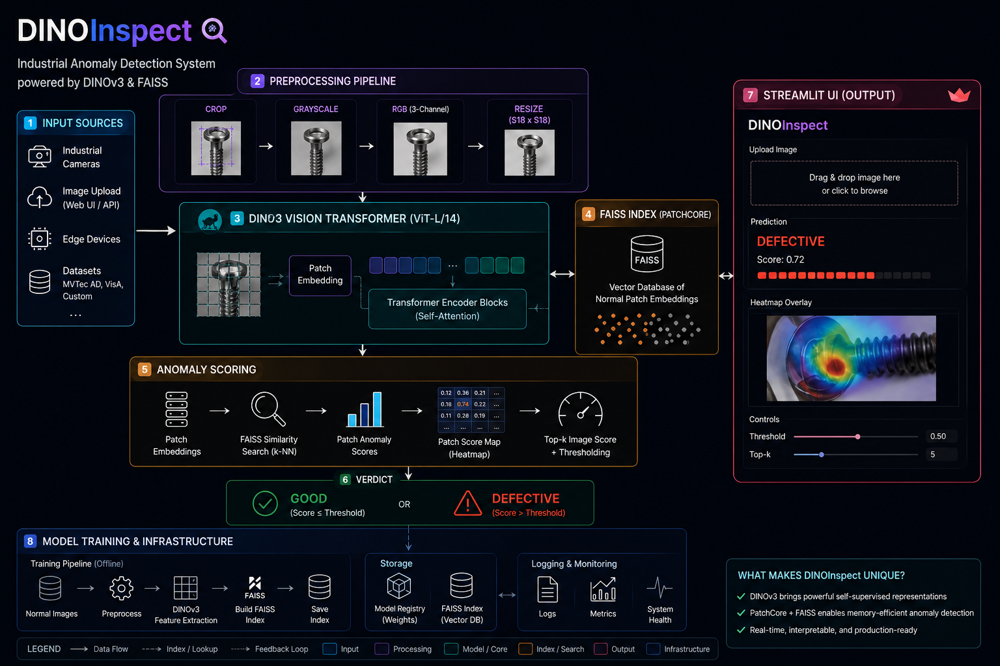

<div align="center">

# DINOInspect

### Unsupervised Industrial Screw Anomaly Detection with DINOv3, FAISS, FastAPI, and Streamlit


**DINOInspect is an end-to-end computer vision inspection system that detects defective industrial screws without training a supervised defect classifier.**

It uses self-supervised DINOv3 patch embeddings to understand what a normal screw looks like, FAISS similarity search to compare new image patches against a memory bank of normal examples, and heatmap visualization to show where the anomaly is likely located.

</div>

---

## Why this project matters

Industrial anomaly detection is hard because defective samples are rare, inconsistent, and expensive to label. Traditional supervised models require examples of every defect type, but real manufacturing defects often appear in unexpected forms.

DINOInspect takes a different approach:

- Learn the visual distribution of **normal screws** only.
- Compare every patch of a test image against a FAISS memory bank.
- Treat visually unfamiliar patches as anomalous.
- Produce both a final verdict and an interpretable heatmap.

This makes the project useful for quality control scenarios where the goal is not just classification, but explainable inspection.

---

## System diagram




Recommended diagram flow:

```text
Input Screw Image
        ↓
Preprocessing: crop → grayscale → RGB → resize
        ↓
DINOv3 Vision Transformer
        ↓
Patch Embeddings
        ↓
FAISS Similarity Search
        ↓
Patch Anomaly Scores
        ↓
Top-k Image Score + Threshold
        ↓
GOOD / DEFECTIVE Verdict
        ↓
Heatmap Overlay in Streamlit UI
```

---

## Core features

### Self-supervised visual inspection
Uses `facebook/dinov3-vits16-pretrain-lvd1689m` as a frozen feature extractor. No supervised defect classifier is trained inside the app.

### Patch-level anomaly localization
The image is split into ViT patch tokens. Each patch receives an anomaly score, allowing the system to highlight suspicious regions instead of only returning a label.

### FAISS-powered memory bank search
Normal patch embeddings are stored in a FAISS index. At inference time, each test patch is compared against the nearest normal patch embedding.

### Threshold-based decision making
The backend loads a saved threshold from `artifacts/threshold.json` and compares the image-level anomaly score against it.

### FastAPI inference service
The backend exposes a clean `/inspect` endpoint for image upload and returns structured JSON containing score, threshold, verdict, latency, and base64 heatmap.

### Streamlit inspection dashboard
The frontend provides a simple upload-based interface with the original image, heatmap overlay, anomaly score, threshold, margin, latency, and final verdict.

---

## How it works

### 1. Model loading
At backend startup, the app loads:

- DINOv3 image processor
- DINOv3 vision model
- FAISS index
- anomaly threshold

This happens once during FastAPI startup so inference requests do not reload the model repeatedly.

### 2. Patch embedding extraction
For every uploaded image:

1. The image is center-cropped.
2. It is converted to grayscale, then back to RGB.
3. It is resized to `448 × 448`.
4. DINOv3 produces patch tokens.
5. Special tokens are removed.
6. Patch embeddings are L2-normalized.

With `IMAGE_SIZE = 448` and `PATCH_SIZE = 16`, the system expects a `28 × 28` patch grid.

### 3. FAISS similarity search
Each patch embedding is searched against the FAISS memory bank using nearest-neighbor similarity. Since embeddings are normalized, inner product search behaves like cosine similarity.

```text
patch anomaly score = 1 - nearest_normal_similarity
```

Higher score means the patch looks less like the normal training distribution.

### 4. Image-level anomaly score
The image score is computed from the most anomalous patches. The current configuration uses the top `1%` patch scores.

```text
image score = mean(top 1% highest patch anomaly scores)
```

This makes the detector sensitive to small localized defects such as cracks, bent regions, damaged threads, or missing screw features.

### 5. Heatmap generation
The patch anomaly map is normalized, resized to the original image size, converted into a color heatmap, and blended with the original image.

The result is returned as a base64 PNG and displayed in the Streamlit UI.

---

## Repository structure

```text
DINOInspect/
│
├── backend/
│   ├── config.py        # Model name, image settings, artifact paths, inference constants
│   ├── inference.py     # Patch extraction, FAISS scoring, heatmap generation, inspection pipeline
│   ├── main.py          # FastAPI app, startup lifecycle, health check, inspect endpoint
│   ├── model.py         # DINOv3 processor/model loading
│   └── schemas.py       # Pydantic response schema
│
├── frontend/
│   └── app.py           # Streamlit UI for upload, inspection, heatmap, and metrics
│
├── artifacts/
│   ├── faiss_index.bin  # Required: saved FAISS memory bank index
│   └── threshold.json   # Required: saved anomaly threshold
│
├── pyproject.toml       # Python version and dependencies
├── .gitignore
└── README.md
```

---

## Tech stack

| Layer | Technology |
|---|---|
| Vision backbone | DINOv3 Vision Transformer |
| Embedding search | FAISS |
| Backend API | FastAPI |
| Frontend UI | Streamlit |
| Image processing | PIL, OpenCV, torchvision transforms |
| Numerical computing | NumPy |
| Model runtime | PyTorch + Hugging Face Transformers |
| Configuration | Python constants + `.env` for frontend backend URL |

---

## API response

The `/inspect` endpoint returns:

```json
{
  "anomaly_score": 0.123456,
  "threshold": 0.100000,
  "verdict": "DEFECTIVE",
  "latency_ms": 842.37,
  "heatmap_overlay_b64": "base64_encoded_png"
}
```

---

## Installation

### 1. Clone the repository

```bash
git clone https://github.com/Basimbaqai/DINOInspect.git
cd DINOInspect
```

### 2. Create a virtual environment

```bash
python -m venv .venv
```

Activate it:

```bash
# Windows
.venv\Scripts\activate

# macOS/Linux
source .venv/bin/activate
```

### 3. Install dependencies

Using `uv`:

```bash
uv sync
```

Or using pip:

```bash
pip install -e .
```

---

## Required artifacts

This app expects the following files:

```text
artifacts/faiss_index.bin
artifacts/threshold.json
```

`faiss_index.bin` should contain the FAISS index built from normal screw patch embeddings.

`threshold.json` should contain the anomaly threshold, for example:

```json
{
  "threshold": 0.123456
}
```

Without these artifacts, the backend will not be able to run inference.

---

## Running the project

### 1. Start the FastAPI backend

Run this from the `backend` folder because the backend currently uses local imports such as `import model` and `import inference`.

```bash
cd backend
uvicorn main:app --reload --host 0.0.0.0 --port 8000
```

Check backend health:

```bash
curl http://localhost:8000/health
```

Expected response:

```json
{"status": "ok"}
```

### 2. Configure the frontend

Create a `.env` file in the project root or frontend environment:

```env
BACKEND_URL=http://localhost:8000
```

### 3. Start the Streamlit frontend

From the project root:

```bash
streamlit run frontend/app.py
```

Then upload a screw image and inspect the result.

---

## Example workflow

1. Upload a screw image through the Streamlit UI.
2. The frontend sends the image to FastAPI.
3. FastAPI extracts DINOv3 patch embeddings.
4. FAISS compares patches against the normal memory bank.
5. The backend computes an anomaly score.
6. The score is compared with the saved threshold.
7. The UI displays:
   - Original image
   - Heatmap overlay
   - Final verdict
   - Anomaly score
   - Threshold
   - Margin
   - Latency

---

## Configuration

Main inference constants are defined in `backend/config.py`.

| Setting | Value | Purpose |
|---|---:|---|
| `MODEL_NAME` | `facebook/dinov3-vits16-pretrain-lvd1689m` | DINOv3 backbone |
| `IMAGE_SIZE` | `448` | Input image size |
| `PATCH_SIZE` | `16` | ViT patch size |
| `NUM_SPECIAL_TOKENS` | `5` | Removes CLS + register tokens |
| `TOP_K_PERCENT` | `0.01` | Uses top 1% anomalous patches for image score |
| `HEATMAP_ALPHA` | `0.55` | Heatmap overlay strength |
| `FAISS_INDEX_PATH` | `artifacts/faiss_index.bin` | Saved memory bank |
| `THRESHOLD_PATH` | `artifacts/threshold.json` | Saved threshold |

---

## Project highlights

- Built a complete anomaly detection application, not just a notebook.
- Uses modern self-supervised vision embeddings instead of hand-crafted features.
- Avoids supervised defect labels by learning from normal samples.
- Provides explainability through patch-level heatmaps.
- Separates backend inference from frontend visualization.
- Uses FAISS for efficient similarity search over patch embeddings.
- Returns production-style structured API responses with latency measurement.

---

## One-line summary

DINOInspect is a self-supervised industrial inspection prototype that combines DINOv3 patch embeddings, FAISS similarity search, FastAPI inference, and Streamlit visualization to detect and localize screw anomalies without supervised defect training.
